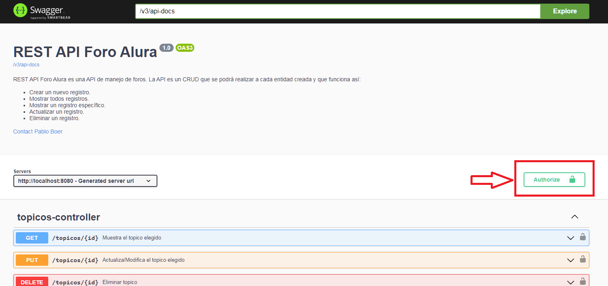

---

   <h1>
      <p align="left">FORO ALURA</p>
   </h1>

---

## Tópicos

- [Descripción del proyecto](#descripción-del-proyecto)

- [Funcionalidad](#funcionalidad)

- [Software de desarrollo](#software-de-desarrollo)

- [En progreso](#en-progreso)

- [Desarrollador](#desarrollador)

- [Agradecimientos](#agradecimientos)

---

## Descripción del proyecto

<p align="justify">
Este proyecto como challenge durante el desarrollo del curso de formación Java del programa Oracle Next Education ONE, en particular la rama de Back End.
<br>
<br>
Crearemos una API REST usando Spring boot, nuestra API estará compuesta por tópicos sobre un curso específico, estos tópicos, así como las respuestas a estos solo podrán ser creados por usuarios registrados.
<br>
<br>
Nuestra API va a centrarse específicamente en los tópicos, y debe permitir a los usuarios:
   
   -  Crear un nuevo registro
   
   -  Mostrar todos registros
   
   -  Mostrar un registro específico
   
   -  Actualizar un registro
   
   -  Eliminar un registro
   
<br>
   <strong>Se realizó en dos Sprints:</strong>
   
   - <strong>Sprint 01:</strong> Se implementó el CRUD del Foro
   
      - Se creó el modelo y las funcionalidades escenciales de la API
   
      - API con rutas implementadas siguiendo las mejores prácticas del modelo REST
   
      - Validaciones realizadas según reglas de negocio   
   
      - Implementación de una base de datos para la persistencia de la información
   
   
   - <strong>Sprint 02:</strong> En este sprint, se implementó un mecanismo de autenticación en la API, para que solo los usuarios autenticados puedan interactuar con ella.
   
      -  Efectuar cambios en la base de datos para almacenar datos de autenticación de los usuarios
   
      -  Insertar maneras de autenticación con Spring Security
   
      -  Uso del token JWT
   
      -  Documentación con Swagger
       

</p>

## Funcionalidad

<p align="justify"> Foro-Alura consta de cuatro entidades (Usuario, Curso, Topico, Respuesta) en las cuales podemos realizar acciones CRUD, para esto contaremos con endpoints específicos que se encargaran de registrar las informaciones requeridas o simplemente ejecutar la acción necesaria, para una mejor comprensión se hace uso de Swagger para documentar la API.
<br>
<br>
<strong>Empezando</strong>

* Dar inicio al servidor de Spring boot.
* Ingresar en http://localhost:8085/doc/swagger-ui/index.html#/
* Abrir autenticacion-controller y generar el token para autenticarse ingresando usuario y contraseña como se muestra a continuación.
  * El CRUD de usuarios está en desarollo, de manera que el unico usuario disponible es nombre: pablo  contraseña: pablo_contrasena 
```json
{
   "nombre": "pablo",
   "contrasena": "pablo_contrasena"
}
```
<div align="center">

</div>

* Buscar el botón authorize en la esquina superior derecha de la página e ingresar el token generado en autenticacion-controller.
 <div align="center">
  
  </div>
 <div align="center">
  
</div>

*  Una vez autenticado podras usar cualquiera de los endpoints generados.
</p>

## Software de desarrollo

   |<a href="https://www.java.com" target="_blank"> <strong>JDK 17.0.6</strong></a>|<a href="https://netbeans.apache.org/" target="_blank"> <strong>NetBeans IDE 14</strong></a>|<a href="https://plugins.netbeans.apache.org/catalogue/?id=4" target="_blank"><strong>NB SpringBoot</strong></a>|
   |------|------|------|
   |<a href="https://www.mysql.com/" target="_blank"><strong>MySQL 8.0.32</strong></a>|<a href="https://swagger.io/" target="_blank"><strong>Swagger</strong></a>|<a href="https://insomnia.rest/" target="_blank"> <strong>Insomnia</strong></a>|

## Codigo fuente

   Foro-Alura esta desarrollado en java implementando Spring Boot.

   * [Repositorio](https://github.com/pabloboer/foro_alura)

## Abrir localmente

Para correr Foro-Alura en tu máquina local:

* Determina donde quieres alojar el proyecto y clonalo en la ubicacion escojida:
   * git clone https://github.com/pabloboer/foro_alura.git

* Con el IDE de tu preferencia procede a abrir el proyecto y ejecutarlo.


## En Progreso
* CRUD Usuarios
* CRUD Respuestas

---
## Desarrollador
<strong>Made by Pablo Boer</strong></br>
<a href="https://www.linkedin.com/in/pablo-boer-1616735a/" target="_blank">
</a>

---

## Agradecimientos

🧡 <strong>Oracle</strong></br>
<a href="https://www.linkedin.com/company/oracle/" target="_blank">
</a>

 💙 <strong>Alura Latam</strong></br>
<a href="https://www.linkedin.com/company/alura-latam/mycompany/" target="_blank">
</a>

